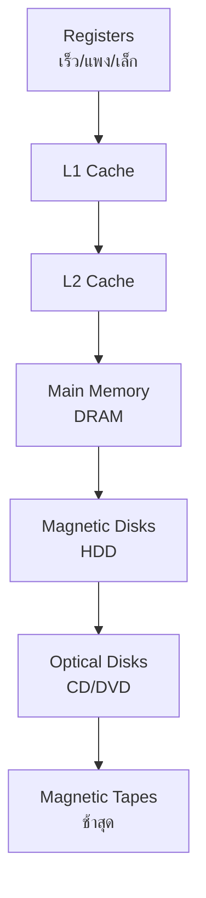

# 4.1 Computer Memory System Overview

**ภาพรวมระบบหน่วยความจำคอมพิวเตอร์** - ให้มุมมองกว้างของลักษณะสำคัญและ Memory Hierarchy

---

## 📋 ลักษณะสำคัญของระบบหน่วยความจำ (**ตาราง 4.1**)

| **Category** | **Characteristics** |
|--------------|---------------------|
| **Location** | **Internal**: Registers, Cache, Main Memory **External**: Disk, Tape, Optical |
| **Capacity** | **Internal**: Bytes/Words (8/16/32 bits) **External**: Bytes |
| **Unit Transfer** | **Word** / **Block** |
| **Access Method** | Sequential / Direct / **Random** / **Associative** |
| **Performance** | **Access time** / **Cycle time** / **Transfer rate** |
| **Physical Type** | **Semiconductor** / Magnetic / Optical |
| **Physical Char.** | **Volatile/Nonvolatile** / **Erasable/Nonerasable** |

---

## 🔍 วิธีการเข้าถึงข้อมูล

| **Access Method** | **ลักษณะ** | **ตัวอย่าง** | **เวลาเข้าถึง** |
|-------------------|-------------|--------------|-----------------|
| **Sequential** | อ่านตามลำดับ | **Tape** | **Variable (นาน)** |
| **Direct** | Address ทางกายภาพ | **Disk** | **Variable** |
| **Random** | เข้าถึงเท่ากันทุกตำแหน่ง | **Main Memory/Cache** | **Constant (เร็ว)** |
| **Associative** | ค้นตาม Content | **Cache** | **Constant (เร็วสุด)** |

---

## ⚡ Performance Parameters
Access Time = เวลาจาก Address → Data พร้อมใช้งาน
Cycle Time = Access Time + Recovery Time
Transfer Rate = 1/Cycle Time (Random Access)

**สูตร Non-Random Access**:
Tn = TA + n/R
TA = Access Time, n = Bits, R = Transfer Rate (bps)

---

## 🔬 **3 แนวคิดสำคัญ (Internal Memory)**

### 1. **Word** (หน่วยธรรมชาติ)
Word size ≈ Integer size ≈ Instruction length
❌ ข้อยกเว้น: CRAY C90 = 64-bit word, 46-bit integer

### 2. **Addressable Unit**
2^A = N
A = Address bits, N = จำนวน Addressable Units
Byte-addressable > Word-addressable (ยืดหยุ่นกว่า)

### 3. **Unit of Transfer**
มัก > Word size: 64/128/256 bits

---

## 🏗️ **Memory Hierarchy** (รูปที่ 4.1)

### **Trade-off ปัญหาหลัก**
| **Fast Memory** | **Slow Memory** |
|-----------------|-----------------|
| ✅ เร็ว | ✅ ถูก |
| ❌ แพง | ❌ ช้า |
| ❌ เล็ก | ✅ ใหญ่ |

### **วิธีแก้: Memory Hierarchy**
ลงสู่ระดับล่าง:
✅ Cost/bit ↓
✅ Capacity ↑
✅ Access Time ↑
✅ Frequency of Access ↓ ← KEY!

---

## ✨ **Locality of Reference** (หลักการสำคัญ)
Programs มีลักษณะ "Cluster":

Loop/Subroutine → Instruction เดียวกันซ้ำ

Table/Array → Data ชิดกัน
→ Hit Ratio สูงเมื่อใช้ Cache!

---

## 📊 **ตัวอย่าง 4.1** - 2-Level Memory
Level 1 (Cache): 1000 words, T1 = 0.01ms
Level 2 (Main): 100K words, T2 = 0.1ms
Hit Ratio h = 95% = 0.95

EAT = h×T1 + (1-h)×(T1+T2)
= 0.95×0.01 + 0.05×(0.01+0.1)
= 0.0095 + 0.0055
= 0.015ms ← ใกล้ T1 มาก!

**กราฟผลลัพธ์** (รูปที่ 4.2):
Hit Ratio สูง → EAT ใกล้ Cache Time

---

## 🎯 **สรุปหัวข้อ 4.1**
✅ 7 ลักษณะสำคัญของ Memory Systems (Table 4.1)
✅ Hierarchy แก้ Trade-off ด้วย Locality Principle
✅ Random/Associative = เร็วสุด (Cache/Main)
✅ External = Sequential/Direct (ช้า)
✅ สูตร: EAT = h×t1 + (1-h)×(t1+t2)

**เป้าหมาย**: **เข้าใจทำไมต้องมี Cache** และ **หลักการ Memory Hierarchy** [file:11]
