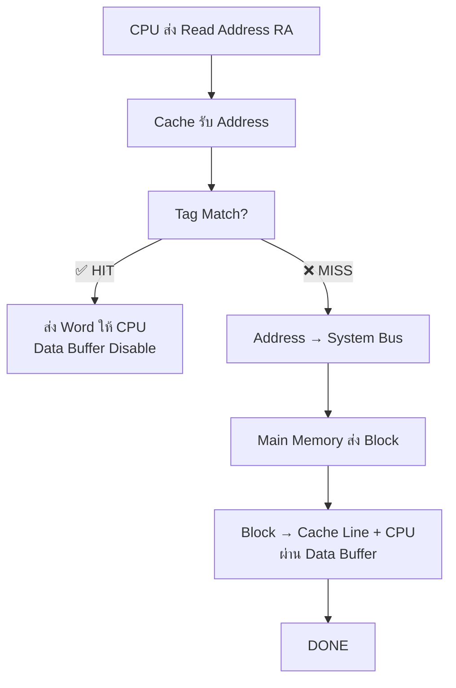

# 📄 4-2-Cache-Memory-Principles.md

# 4.2 Cache Memory Principles

**หลักการหน่วยความจำแคช** - อธิบายแนวคิดพื้นฐาน การทำงาน และโครงสร้างของ Cache Memory

---

## 🎯 แนวคิดพื้นฐาน Cache Memory
CPU ──────[FAST/SMALL]────── Cache ──────[SLOW/LARGE]────── Main Memory
↑ ↑
Copy of portions Original Data
ของ Main Memory

**เป้าหมาย**: รวม**ความเร็วของ Fast Memory** + **ความจุของ Slow Memory**

---

## 🔄 **Cache Hit vs Cache Miss**

| **สถานการณ์** | **กระบวนการ** | **เวลา** | **ความน่าจะเป็น** |
|----------------|---------------|----------|-------------------|
| **Cache **Hit**** | Address → Check Tag → **Match** → ส่ง Data | **T_cache** | **สูง** (Locality) |
| **Cache **Miss**** | Address → Check Tag → **No Match** → Load **Block** จาก Main → Update Cache → ส่ง Data | **T_cache + T_transfer** | **ต่ำ** |

---

## 🏗️ **โครงสร้าง Cache-Main Memory** (รูปที่ 4.4)

### **Main Memory**
Total: 2^n addressable words
Block size: K words/block
จำนวน Blocks: M = 2^n / K

### **Cache Structure**
Cache: m lines (m << M)
Each Line = [Tag][K words][Control Bits]
Line Size: K words + Tag (few bits)

**ตัวอย่าง**:
Main Memory: 16MB = 2^24 bytes
Cache: 64KB = 16K lines
Block: 4 bytes → 16M/4 = 4M blocks
m = 16K << 4M blocks

---

## 📋 **Cache Line Components**

| **Component** | **วัตถุประสงค์** |
|---------------|-------------------|
| **Tag** | ระบุ Main Memory Block ไหน |
| **Data** | K words (เช่น 4/8/16/32/64 bytes) |
| **Control Bits** | Valid Bit, Dirty Bit, LRU Bits |

---

## 🔍 **Cache Read Operation** (รูปที่ 4.5, 4.6)

### **Cache Organization** (รูปที่ 4.6)
CPU ↔ [Address Buffer] ↔ Cache ↔ [Data Buffer] ↔ System Bus ↔ Main Memory

**Hit**: CPU-Cache สื่อสารตรง (ไม่ใช้ Bus)  
**Miss**: Cache + CPU รับข้อมูลพร้อมกันผ่าน Buffer

---

## 🎲 **ตัวอย่างการทำงาน**
สมมติ: Main Memory 16MB, Cache 64KB, Block 4 bytes
Address: 24 bits = [8-bit Tag][14-bit Line][2-bit Word]

CPU ส่ง Address: 00FF1234

Line = 1234 (14 bits) → เลือก Cache Line #1234

Tag = 00FF → เปรียบเทียบกับ Tag ใน Line #1234

Match → HIT → ส่ง Word #2 (34)

No Match → MISS → โหลด Block 00FF1200-00FF123F

---

## ✨ **ทำไม Cache ถึงได้ผล?** - Locality of Reference
Temporal Locality: Loop → Instruction/Data เดียวกันซ้ำ

Spatial Locality: Array → Data ชิดกัน

→ Block 1 Block → ใช้หลายครั้ง → Hit Ratio สูง!

---

## 📊 **Multi-Level Cache** (รูปที่ 4.3b)
CPU → L1 (เร็วสุด) → L2 → L3 → Main Memory
Hit Ratio: L1 > L2 > L3

**L1**: เล็กสุด เร็วสุด (ใน CPU)  
**L2/L3**: ใหญ่กว่า ช้ากว่า (นอก CPU)

---

## 🎯 **สรุปหลักการ Cache Memory**
✅ Cache = เล็ก+เร็ว เก็บ "Copy" บางส่วนของ Main Memory
✅ Block Transfer: Miss → โหลด K words (ไม่ใช่แค่ 1 word)
✅ Hit Ratio สูงจาก Locality Principle
✅ Read Operation: Parallel CPU+Cache รับข้อมูล (Miss)
✅ Multi-Level: L1→L2→L3 เพิ่มประสิทธิภาพ

**เป้าหมาย**: **ลด Average Access Time** โดยใช้ Fast Cache [file:11]
