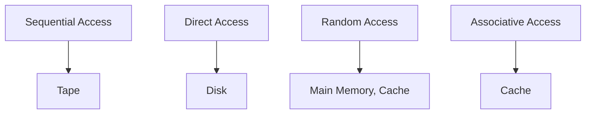
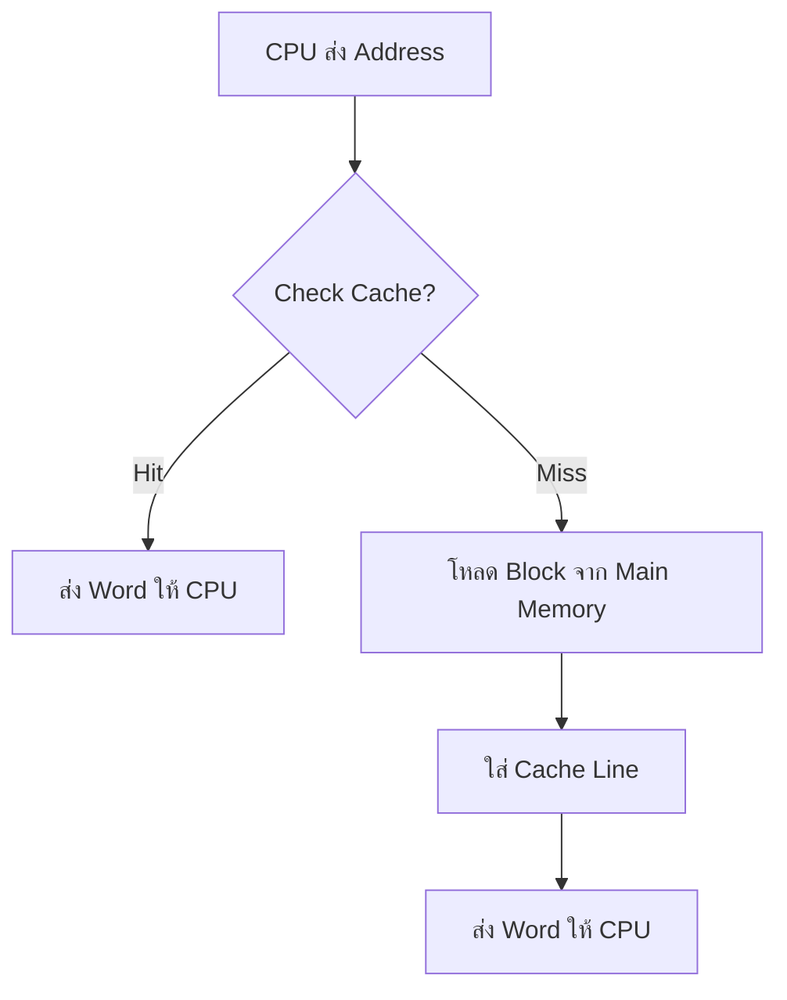

# 📚 สรุปแบบละเอียด: บทที่ 4 - Cache Memory

**ชื่อบท**: **Cache Memory** (หน่วยความจำแคช)  
**เนื้อหาหลัก**: ระบบหน่วยความจำคอมพิวเตอร์และเทคนิคการใช้ Cache เพื่อเพิ่มประสิทธิภาพ [file:11]

---

## 📋 สารบัญ

1. **[4.1 Computer Memory System Overview](#41-computer-memory-system-overview)** 
2. **[4.2 Cache Memory Principles](#42-cache-memory-principles)**
3. **[4.3 Elements of Cache Design](#43-elements-of-cache-design)**
4. **[4.4 Pentium 4 Cache Organization](#44-pentium-4-cache-organization)**
5. **[Appendix 4A: Two-Level Memory Performance](#appendix-4a-two-level-memory-performance)**

---

## 4.1 Computer Memory System Overview

### ลักษณะสำคัญของระบบหน่วยความจำ (ตาราง 4.1)

| **Category** | **Characteristics** |
|--------------|---------------------|
| **Location** | Internal (Registers, Cache, Main Memory) External (Disk, Tape, Optical) |
| **Capacity** | Words/Bytes |
| **Unit Transfer** | Word/Block |
| **Access Method** | Sequential/Direct/Random/Associative |
| **Performance** | Access time, Cycle time, Transfer rate |
| **Physical Type** | Semiconductor/Magnetic/Optical |
| **Physical Char.** | Volatile/Nonvolatile, Erasable/Nonerasable |

### วิธีการเข้าถึงข้อมูล

### Memory Hierarchy (รูปที่ 4.1)
Registers (เร็ว/แพง/เล็ก)
↓
L1 Cache (L1)
↓
L2 Cache (L2)
↓
Main Memory (DRAM)
↓
Magnetic Disks
↓
Optical Disks (CD/DVD/Blu-ray)
↓
Magnetic Tapes

**หลักการ**: **Locality of Reference** - Memory references มีแนวโน้ม cluster กัน [file:11]

**ตัวอย่าง 4.1**: 
- L1: 1000 words, 0.01ms
- L2: 100,000 words, 0.1ms  
- Hit ratio 95% → **Average access time = 0.015ms** [file:11]

---

## 4.2 Cache Memory Principles

### แนวคิดพื้นฐาน
CPU ──[Fast/Small]── Cache ──[Slow/Large]── Main Memory
↑ ↑
Copy of Original
portions of MM Data

### Cache Hit vs Cache Miss

| **สถานการณ์** | **กระบวนการ** | **เวลา** |
|----------------|---------------|----------|
| **Cache Hit** | Check → พบ → ส่งข้อมูล | T_cache |
| **Cache Miss** | Check → ไม่พบ → โหลด Block → ส่ง | T_cache + T_transfer |

### โครงสร้าง Cache (รูปที่ 4.4)
Cache Line = [Tag][Data (K words)][Control Bits]
Main Memory Block = K words (ถาวร)

**ตัวอย่าง**:
- Main Memory: 2^n words
- Cache: m lines (m << 2^n/K)
- Block size: K words [file:11]

### Cache Read Operation (รูปที่ 4.5)

---

## 4.3 Elements of Cache Design

### องค์ประกอบการออกแบบ (ตาราง 4.2)

| **Design Element** | **ตัวเลือก** |
|--------------------|-------------|
| **Cache Addresses** | Logical/Physical |
| **Cache Size** | 8KB-หลาย MB |
| **Mapping Function** | Direct/Associative/Set-Associative |
| **Replacement** | LRU/FIFO/LFU/Random |
| **Write Policy** | Write-through/Write-back |
| **Line Size** | 32-256 bits |
| **# of Caches** | L1/L2/L3 |

### 1. Cache Addresses
Logical Cache: Processor → Cache → MMU → Main Memory (เร็ว)
Physical Cache: Processor → MMU → Cache → Main Memory (ปลอดภัย)

### 2. Mapping Functions

#### **Direct Mapping**
i = j mod m
Block j → เส้นทางเดียว (Line i)
**ข้อดี**: ง่าย ถูก  
**ข้อเสีย**: Thrashing (冲突)

#### **Fully Associative** 
Block j → ทุก Line ได้
**ข้อดี**: ยืดหยุ่น  
**ข้อเสีย**: ช้า แพง

#### **Set-Associative (k-way)**
i = j mod v, Block j → Set i (k lines)
**ตัวอย่าง**: 2-way, 4-way set-associative [file:11]

**กราฟประสิทธิภาพ** (รูปที่ 4.16):
Hit Ratio:
Direct < 2-way < 4-way < 8-way (แต่ Cost เพิ่ม)

### 3. Replacement Algorithms

| **Algorithm** | **หลักการ** |
|---------------|-------------|
| **LRU** | เปลี่ยนอันที่ไม่ใช้มานานสุด |
| **FIFO** | เปลี่ยนอันที่เข้ามานานสุด |
| **LFU** | เปลี่ยนอันที่ใช้น้อยสุด |
| **Random** | สุ่ม |

### 4. Write Policies

| **Write-through** | **Write-back** |
|-------------------|----------------|
| เขียน Cache + Main Memory | เขียนเฉพาะ Cache |
| ปลอดภัย | เร็ว |
| ช้า | Dirty Bit |

---

## 4.4 Pentium 4 Cache Organization

**Pentium 4 Cache Hierarchy**:
L1: 8KB I-Cache + 8KB D-Cache (Separate)
L2: 256KB-2MB (Unified)
L3: External (Optional)

**Advanced Features**:
- Trace Cache (L1 Instruction)
- Advanced Branch Prediction
- Non-blocking Cache [file:11]

---

## Appendix 4A: Two-Level Memory Performance

### สูตรคำนวณ
Effective Access Time = h × t1 + (1-h) × (t1 + t2)
h = Hit Ratio, t1 = Cache time, t2 = Main Memory time

**Hit Ratio = 95%**:EAT = 0.95×0.01 + 0.05×(0.01+0.1) = 0.015ms

---

## 🎯 สรุปหลักการสำคัญ
Memory Hierarchy แก้ Trade-off: Speed/Capacity/Cost

Cache ใช้ Locality → High Hit Ratio → Low Average Access Time

Set-Associative (2-4 way) = สมดุลดีที่สุด

Multi-level Cache (L1,L2,L3) เพิ่มประสิทธิภาพ
