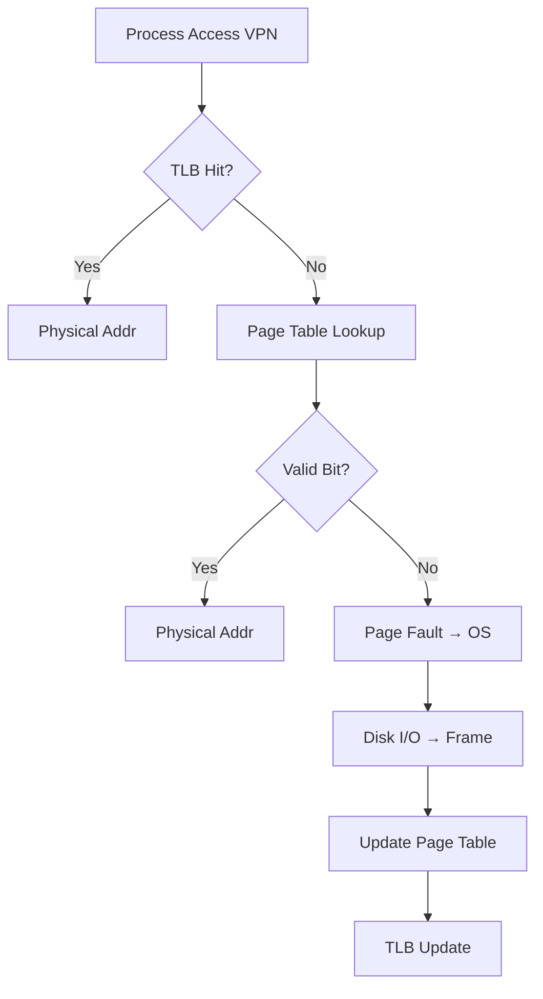

# 8.1 Virtual Memory Overview

**ภาพรวมหน่วยความจำเสมือน** - ระบบขยาย Main Memory ด้วย Disk และจัดการ Memory อย่างมีประสิทธิภาพ

---

## 🎯 **แนวคิดพื้นฐาน Virtual Memory**
Virtual Address Space (32-bit): 4GB
↓
Physical Main Memory: 512MB-4GB
↓
Disk (Backing Store): TBs

**หลักการ**: **Process "เห็น" Virtual Address Space เต็ม** ไม่ว่าจริงๆ Main Memory จะเล็กแค่ไหน

---

## 🏗️ **Background: Swapping (ยุคแรก)**
Process ขนาดใหญ่ > Main Memory
→ Swap ทั้ง Process ออกจาก Main Memory ไป Disk
**ปัญหา**:
External Fragmentation

I/O Overhead สูง (Swap ทั้ง Process)

ไม่ Support Multiprogramming ดี

---

## ✨ **Virtual Memory Benefits** (5 ประการสำคัญ)

| **ประโยชน์** | **รายละเอียด** |
|--------------|----------------|
| **1. Large Virtual Address Space** | รันโปรแกรม 4GB+ บนเครื่อง 256MB |
| **2. More Multiprogramming** | Main Memory เต็ม → ใช้ Disk |
| **3. Isolation** | Process A ไม่เห็น Memory ของ B |
| **4. Sharing** | Shared Libraries/Code Pages |
| **5. Demand Paging** | Load เฉพาะ Pages ที่ใช้ |

---

## 📋 **2 วิธีการทำ Virtual Memory**

### **A. Paging** ⭐ **ใช้จริง**
Memory = Fixed-size Pages (4KB)
Virtual Memory = Pages
Physical Memory = Frames (ขนาดเท่ากัน)
**✅ ข้อดี**:
- **No External Fragmentation**
- จัดการง่าย (Page Table)

### **B. Segmentation**
Memory = Variable-size Segments (Code/Data/Stack)
**✅ ข้อดี**: Semantic Division  
**❌ ข้อเสีย**: **External Fragmentation**

---

## 🔍 **Paging: รายละเอียด**

### **โครงสร้าง Address**
32-bit Virtual Address:
┌─────────────────────┬──────────────┐
│ Virtual Page Number │ Page Offset │ 4KB
│ (20 bits) │ (12 bits) │ Pages
└─────────────────────┴──────────────┘
│ │
▼ ▼
Page Table Physical
Entry (PTE) Frame

Physical Address:
┌──────────────────┬──────────────┐
│Frame Number (18b)│ Page Offset │
└──────────────────┴──────────────┘

### **Page Table**
Process 1 Page Table:
Page# | Frame# | Valid | Dirty | Ref
0 | 100 | 1 | 0 | 1
1 | 200 | 1 | 1 | 1
2 | Disk | 0 | - | -

---

## 🔄 **Demand Paging Process**

---

## 📊 **ตัวอย่างการทำงาน**
สมมติ: Page Size = 4KB, Main Memory = 16 Frames

Process A Virtual Addr: 0x00012345
= Page# 0x123 (291), Offset 0x345

TLB Miss → Page Table

Page#291 → Frame#5, Valid=1

Physical Addr = Frame#5 + Offset 0x345

Memory[Frame#5 + 0x345]

**Page Fault Case**:
Page#300 → Valid=0 → Disk → Frame#10 → Update PTE

---

## ⚙️ **Page Table Entry (PTE) Structure**
PTE (4 bytes):
┌──────┬──────┬──────┬──────┐
│ PFN │Valid │Dirty │Ref │
│(18b) │ 1b │ 1b │ 1b │
└──────┴──────┴──────┴──────┘

Protection Bits (R/W/X)

---

## 🎯 **เปรียบเทียบ Swapping vs Virtual Memory**

| **Swapping** | **Virtual Memory** |
|--------------|--------------------|
| Swap **ทั้ง Process** | Load **Page เดียว** |
| External Frag ❌ | **No External Frag** |
| I/O สูง | **I/O ต่ำ** |
| ไม่ Flexible | **Multiprogramming ดี** |

---

## 💡 **Key Concepts**
Virtual Address Space >> Physical Memory

Page = Frame (Fixed Size) → No External Frag

Page Table: Virtual Page → Physical Frame

Demand Paging: Load เมื่อต้องการ → Page Fault

Sharing: Multiple Processes ใช้ Pages เดียวกัน

---

## 🎯 **สรุป 8.1 Virtual Memory Overview**
✅ Virtual Memory = Main Memory + Disk (Backing Store)
✅ Paging > Segmentation (จัดการง่าย)
✅ 5 Benefits: Large Programs + Multiprogramming + Isolation + Sharing + Demand Paging
✅ Address Translation: VPN → PFN + Offset
✅ Page Fault = OS Intervention (Disk I/O)

"โปรแกรมเมอร์ไม่ต้องรู้ Physical Memory จริง!"
**เป้าหมาย**: **ขยาย Memory + Multiprogramming + Protection** [file:11]
